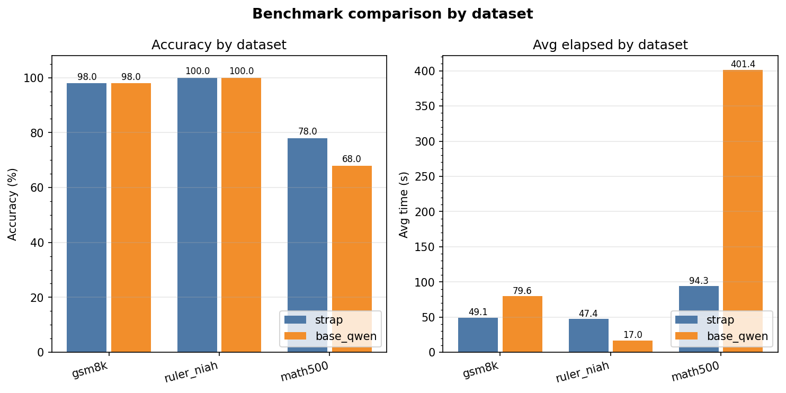
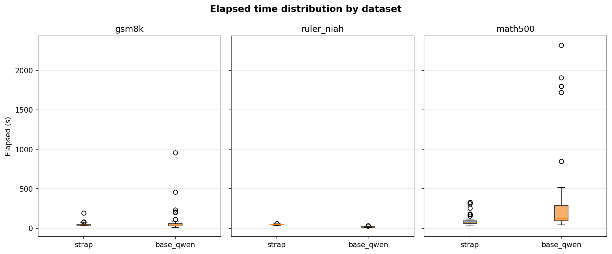
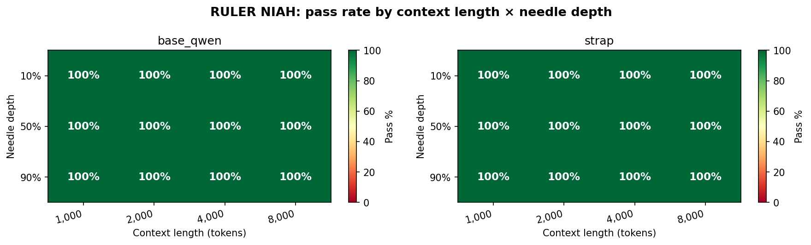

# strap-benchmark

A harness-agnostic benchmark for comparing LLM inference backends on reasoning, memory, and long-context retrieval tasks.

Originally written to evaluate [Strap](https://therohans.com/strap/), a closed-source LLM harness optimised for small models, against a raw llama.cpp baseline using the same underlying model (currently Qwen 3.6 27B on a Nvidia RTX 5080 16GB (but could be anything)). The benchmark design keeps the underlying model constant so any accuracy or latency difference is attributable to the harness, not to model quality.

---

## Examples









---

## What is Strap?

Strap is a closed-source AI harness designed for small, locally-hosted models. Its distinguishing features relative to a bare llama.cpp call are:

- **Persistent session memory** — conversation history is managed across turns in a compressed format optimised for small context windows.
- **Lisp interpreter tool** — deterministic arithmetic and symbolic reasoning are offloaded to an embedded Lisp evaluator rather than relying on the model's arithmetic.
- **Context-window optimisation** — a proprietary packing scheme maximises usable context on models with small windows.
- **Sub-agent architecture** — complex tasks are broken into sub-tasks dispatched as separate model calls and reassembled.

Strap can be used in TUI mode (on your local system), or it exposes itself as a **single-client IRC server** (port 6667 by default) when run in server mode. Clients register with NICK/USER (and optionally PASS), then post messages to `#main` via `PRIVMSG`. Responses arrive as PRIVMSG lines from the `strap` nick. The server auto-joins the client to `#main` on registration; no explicit JOIN is needed.

---

## Benchmark structure

```
strap-benchmark/
├── run.py                  # entry point — loads tasks, runs runners, prints table, saves JSON
├── evaluate.py             # scoring: exact, contains, llm_judge
├── analyze.py              # matplotlib charts from saved result JSON files
├── test_strap_connection.py # smoke test: connects to Strap and asserts a response arrives
│
├── runners/
│   ├── __init__.py         # Runner protocol (structural typing — duck typing is fine)
│   ├── qwen.py             # Baseline: direct Ollama OpenAI-compatible API, no harness
│   ├── strap.py            # Strap: IRC client with silence-detection response collection
│   └── opencode.py         # Stub for OpenCode (TUI — invocation may need updating)
│
├── adapters/
│   ├── gsm8k.py            # openai/gsm8k — grade-school math, exact numeric answers
│   ├── math_ds.py          # HuggingFaceH4/MATH-500 — competition math, LLM-judged
│   └── ruler.py            # Synthetic NIAH (needle-in-a-haystack) long-context tasks
│
├── tasks/                  # Hand-written task fixtures (JSON)
│   ├── reasoning/          # Single-turn math / logic
│   ├── memory/             # Multi-turn: does the model honour an earlier constraint?
│   └── context/            # Long-context retrieval
│
└── results/                # Saved run JSON (gitignored except .gitkeep)
```

---

## Quick start

```bash
pip install -r requirements.txt

make all
```

Results are printed as a comparison table and saved to `results/<timestamp>.json`.

---

## Datasets

| Flag | Dataset | Eval method | What it tests |
|---|---|---|---|
| `--dataset gsm8k` | `openai/gsm8k` | `contains` (exact number) | Grade-school arithmetic reasoning |
| `--dataset math` | `HuggingFaceH4/MATH-500` | `llm_judge` | Competition math (algebra, geometry, number theory…) |
| `--dataset ruler` | Synthetic (NIAH) | `contains` | Long-context retrieval at configurable depths |

### Useful flags

```
--max-samples N       cap tasks per dataset
--max-level N         MATH-500 only: difficulty 1–5 (default 5)
--context-lengths     RULER: token counts, comma-separated (default 2000,4000,8000)
--needle-depths       RULER: insertion depths 0.0–1.0 (default 0.1,0.5,0.9)
--ruler-n N           RULER: tasks per (length, depth) config (default 3)
--log-level           DEBUG / INFO / WARNING / ERROR (default WARNING)
```

---

## Adding a new runner

Implement three methods — `run`, `reset`, `close` — and add an entry to `RUNNERS` in `run.py`. No base class required; the `Runner` protocol in `runners/__init__.py` is purely for editor type-checking.

```python
class MyRunner:
    def run(self, task: dict) -> str:
        # task keys: id, type, prompt, eval, expected, [turns]
        ...

    def reset(self) -> None:
        # called before each task — clear session state
        ...

    def close(self) -> None:
        # called after all tasks — disconnect / cleanup
        ...
```

For runners that need a connection step (like the IRC runner), add a `connect()` method — `run.py` checks for it and calls it automatically before the first task.

---

## Task format (JSON fixtures)

### Reasoning / single-turn

```json
{
  "id":       "reasoning_001",
  "type":     "reasoning",
  "eval":     "contains",
  "prompt":   "What is the sum of all prime numbers less than 50?",
  "expected": ["328"]
}
```

### Memory / multi-turn

```json
{
  "id":          "memory_001",
  "type":        "memory",
  "eval":        "llm_judge",
  "judge_prompt": "Does the response respect the $300 budget? PASS or FAIL.",
  "turns": [
    {"role": "user",      "content": "My total budget is $300. Keep that in mind."},
    {"role": "assistant", "content": "Got it."},
    {"role": "user",      "content": "What GPU should I get?"}
  ]
}
```

All previous turns are fed to the model before the final user message. For the Strap runner, each user turn is sent as a separate PRIVMSG and intermediate responses are collected but not scored.

### Eval methods

| Value | Behaviour |
|---|---|
| `exact` | `expected` string must appear (case-insensitive) in normalised response |
| `contains` | all strings in `expected` list must appear after markdown normalisation |
| `llm_judge` | a second model call (default: same Ollama endpoint) scores PASS / FAIL given `judge_prompt` |

Normalisation strips markdown bold/italic, currency symbols, and thousands separators so `**$70,000**` matches `70000`.

---

## Strap runner details

```python
# Environment variables
STRAP_HOST      # default: localhost
STRAP_PORT      # default: 6667
STRAP_PASSWORD  # optional
STRAP_CHANNEL   # default: #main (server always auto-joins here)
```

The runner opens a TCP socket, registers with `PASS / NICK / USER`, then sends each task as a `PRIVMSG #main :<prompt>`. Responses are collected by a background thread that reads PRIVMSG lines from the server. Collection ends when there are `silence_secs` (default 4 s) of quiet after at least one message arrives, or `timeout_secs` (default 60 s) without any response.

`.clear` is sent between tasks to reset Strap's session history.

**Important:** Strap is a single-client server. Connecting a second client (e.g. an IRC client for debugging) will block the benchmark. Disconnect any other client before running.

### Timing asymmetry

The IRC runner measures wall time from send to end-of-silence. Because Strap streams tokens to the channel as they are generated, the clock stops 4 s after the *last token* — not after the model finishes. The Qwen baseline runner waits for the full synchronous API response. This makes Strap appear faster on wall-clock time; it is not an apples-to-apples latency comparison. Document this when reporting results.

---

## Smoke test

```bash
STRAP_HOST=192.168.1.36 STRAP_PASSWORD=<pass> python test_strap_connection.py
```

Connects, sends `"test"`, asserts a non-empty response arrives within 60 s. Run this before a full benchmark to confirm connectivity.

---

## Analysing results

```bash
# bar charts: accuracy % and avg elapsed per dataset
python analyze.py

# filter to one dataset
python analyze.py --chart source --source gsm8k

# save to file
python analyze.py --chart source --out comparison.png

# trend over multiple runs
python analyze.py --chart time

# per-task scatter (pass/fail vs elapsed)
python analyze.py --chart tasks
```

Result files have the envelope format:

```json
{
  "meta": { "timestamp": "20260603_234539", "datasets": ["gsm8k"], ... },
  "results": {
    "base_qwen": [ { "id": "gsm8k_0000", "pass": true, "elapsed": 51.2, ... }, ... ],
    "strap":     [ ... ]
  }
}
```

---

## Methodology notes

- The same base model (Qwen 3.6 27B via llama.cpp) runs under both the raw baseline and Strap. Model quality is held constant; only the harness differs.
- MATH-500 answers are LaTeX expressions — `llm_judge` scoring uses a second model call and is not perfectly deterministic. Run multiple times and report mean ± stddev if precision matters. Math-500 is currently judged by qwen2.5-math-7b-instruct running on a different server than the harness or the Qwen 3.6 model.
- RULER context lengths are measured in characters ÷ 4 (rough token approximation). Actual token counts vary by tokeniser.
- The Strap sub-agent architecture means it may issue multiple underlying model calls per task. Elapsed time includes all of them. This is intentional — the benchmark measures end-to-end task latency, not single-call latency.

---

## Running all benchmarks

See the Makefile for all the tasks and settings

---

## Other benchmarks to consider

Ranked by how directly they test Strap's specific features vs. general model quality.

| Benchmark | HuggingFace ID | Strap feature tested | Eval | Effort | Notes |
|---|---|---|---|---|---|
| **ARC-Challenge** | `allenai/ai2_arc` | General reasoning (sanity check) | `exact` (A/B/C/D) | Low | Good floor check — if the harness hurts here, something is wrong |
| **MMLU** | `cais/mmlu` | General knowledge + reasoning | `exact` (letter) | Low | 57 subjects; subsample `math`, `formal_logic`, `abstract_algebra` to stay relevant |
| **IFEval** | `google/IFEval` | Instruction following under constraints | Rule-based | Medium | Tests whether constraints stated earlier in a session are honoured — directly relevant to Strap's memory feature |
| **BBH** (BIG-Bench Hard) | `lukaemon/bbh` | Multi-step reasoning | `exact` | Medium | 23 hard tasks; `logical_deduction`, `multistep_arithmetic`, `word_sorting` are most on-point |
| **HumanEval** | `openai/openai_humaneval` | Code generation | Execute + `exact` | Medium | Needs a sandbox to run generated code; tests whether sub-agents improve code quality |
| **MBPP** | `google-research-datasets/mbpp` | Code generation (simpler) | Execute + `exact` | Medium | Easier than HumanEval, better suited to 14B-scale local models |
| **LongBench** | `THUDM/LongBench` | Long-context QA + summarisation | `contains` / `llm_judge` | Medium | Real documents instead of RULER's synthetic filler; tests context management on authentic text |
| **LONGMEMEVAL** | `xiaowu0162/longmemeval` | Session memory across turns | `exact` / `contains` | Medium-High | The most direct test of Strap's memory feature — measures recall across a long simulated session |
| **MT-Bench** | `lmsys/mt_bench_questions` | Multi-turn instruction following | `llm_judge` (GPT-4) | High | Requires a strong judge model; good for showcasing Strap's multi-turn handling |
| **AIME 2024** | Hand-curated (30 problems) | Hard math — Lisp tool advantage | `exact` | Low | Small dataset but brutal; AMC/AIME is where Lisp-backed deterministic math should stand out most |
| **GPQA Diamond** | `Idavidrein/gpqa` | Expert-level science reasoning | `exact` (letter) | Low | PhD-level questions; tests whether sub-agent decomposition helps with hard factual reasoning |
| **τ-bench** | `sierra-research/tau-bench` | Tool-using agents in realistic tasks | Custom | High | Measures correct tool use across multi-step retail/airline scenarios — closest to Strap's real-world use case |

### Suggested priority

Given Strap's three core claims (memory, deterministic math via Lisp, context-window optimisation):

1. **MATH-500** — clearest Lisp-tool signal (already implemented)
2. **LONGMEMEVAL** — clearest memory signal; the benchmark Strap was most built for
3. **RULER** — context packing signal (already implemented)
4. **ARC-Challenge** — 20-minute sanity check that the harness causes no regression
5. **IFEval** — instruction-following under constraints; strong demo story for memory
6. **AIME** — small, brutal math; if Lisp fires reliably the accuracy gap should be dramatic

MMLU, HumanEval, and τ-bench are worth running once OpenCode is a working third runner — they show general model quality differences more than harness differences.

---

## Results (initial GSM8K run, 50 samples)

| | strap | base_qwen |
|---|---|---|
| Accuracy | 98% | 100% |
| Avg elapsed | 31.1 s | 88.8 s |

The 3× speed difference is largely explained by streaming (IRC silence detection) vs synchronous API response — see timing asymmetry note above. The single missed answer is worth investigating: whether Strap's Lisp tool fired and produced an incorrect result, or whether the model reasoned incorrectly in the main agent.

MATH-500 and RULER results pending.

---

## References

### Implemented datasets

**GSM8K**
Cobbe, K., Kosaraju, V., Bavarian, M., Chen, M., Jun, H., Kaiser, L., Plappert, M., Tworek, J., Hilton, J., Nakano, R., Hesse, C., & Schulman, J. (2021).
*Training Verifiers to Solve Math Word Problems.*
arXiv:2110.14168. https://arxiv.org/abs/2110.14168

**MATH-500**
Hendrycks, D., Burns, C., Kadavath, S., Arora, A., Basart, S., Tang, E., Song, D., & Steinhardt, J. (2021).
*Measuring Mathematical Problem Solving With the MATH Dataset.*
arXiv:2103.03874. https://arxiv.org/abs/2103.03874

The 500-problem subset used here (`HuggingFaceH4/MATH-500`) is from:
Lightman, H., Kosaraju, V., Burda, Y., Edwards, H., Baker, B., Lee, T., Leike, J., Schulman, J., Sutskever, I., & Cobbe, K. (2023).
*Let's Verify Step by Step.*
arXiv:2305.20050. https://arxiv.org/abs/2305.20050

**RULER / NIAH (Needle In A Haystack)**
Hsieh, C.-P., Sun, S., Kriman, S., Acharya, S., Rekesh, D., Jia, F., Zhang, Y., & Ginsburg, B. (2024).
*RULER: What's the Real Context Size of Your Long Context Language Models?*
arXiv:2404.06654. https://arxiv.org/abs/2404.06654

The original NIAH concept:
Kamradt, G. (2023). *LLMTest_NeedleInAHaystack.*
https://github.com/gkamradt/LLMTest_NeedleInAHaystack

---

### Additional benchmarks (papers)

**ARC (AI2 Reasoning Challenge)**
Clark, P., Cowhey, I., Etzioni, O., Khot, T., Sabharwal, A., Schoenick, C., & Tafjord, O. (2018).
*Think you have Solved Question Answering? Try ARC, the AI2 Reasoning Challenge.*
arXiv:1803.05457. https://arxiv.org/abs/1803.05457

**MMLU (Massive Multitask Language Understanding)**
Hendrycks, D., Burns, C., Basart, S., Zou, A., Mazeika, M., Song, D., & Steinhardt, J. (2021).
*Measuring Massive Multitask Language Understanding.*
arXiv:2009.03300. https://arxiv.org/abs/2009.03300

**IFEval (Instruction-Following Evaluation)**
Zhou, J., Lu, T., Mishra, S., Brahma, S., Basu, S., Luan, Y., Zhou, D., & Hou, L. (2023).
*Instruction-Following Evaluation for Large Language Models.*
arXiv:2311.07911. https://arxiv.org/abs/2311.07911

**BIG-Bench Hard (BBH)**
Suzgun, M., Scales, N., Schärli, N., Gehrmann, S., Tay, Y., Chung, H. W., Chowdhery, A., Le, Q. V., Chi, E. H., Zhou, D., & Wei, J. (2022).
*Challenging BIG-Bench Tasks and Whether Chain-of-Thought Can Solve Them.*
arXiv:2210.09261. https://arxiv.org/abs/2210.09261

**HumanEval**
Chen, M., Tworek, J., Jun, H., Yuan, Q., Pinto, H. P. d. O., Kaplan, J., Edwards, H., Burda, Y., Joseph, N., Brockman, G., Ray, A., Puri, R., Krueger, G., Petrov, M., Khlaaf, H., Sastry, G., Mishkin, P., Chan, B., Gray, S., … Zaremba, W. (2021).
*Evaluating Large Language Models Trained on Code.*
arXiv:2107.03374. https://arxiv.org/abs/2107.03374

**MBPP (Mostly Basic Programming Problems)**
Austin, J., Odena, A., Nye, M., Bosma, M., Michalewski, H., Dohan, D., Jiang, E., Cai, C. J., Terry, M., Le, Q., & Sutton, C. (2021).
*Program Synthesis with Large Language Models.*
arXiv:2108.07732. https://arxiv.org/abs/2108.07732

**LongBench**
Bai, Y., Lv, X., Zhang, J., Lyu, H., Tang, J., Huang, Z., Du, Z., Liu, X., Zeng, A., Hou, L., Dong, Y., Tang, J., & Li, J. (2023).
*LongBench: A Bilingual, Multitask Benchmark for Long Context Understanding.*
arXiv:2308.14508. https://arxiv.org/abs/2308.14508

**LONGMEMEVAL**
Wu, X., Wang, H., & Yu, T. (2024).
*LongMemEval: Benchmarking Chat Assistants on Long-Term Interactive Memory.*
arXiv:2410.10813. https://arxiv.org/abs/2410.10813

**MT-Bench**
Zheng, L., Chiang, W.-L., Sheng, Y., Zhuang, S., Wu, Z., Zhuang, Y., Lin, Z., Li, Z., Li, D., Xing, E. P., Zhang, H., Gonzalez, J. E., & Stoica, I. (2023).
*Judging LLM-as-a-Judge with MT-Bench and Chatbot Arena.*
arXiv:2306.05685. https://arxiv.org/abs/2306.05685

**GPQA (Graduate-Level Google-Proof Q&A)**
Rein, D., Hou, B. L., Stickland, A. C., Petty, J., Pang, R. Y., Dirani, J., Michael, J., & Bowman, S. R. (2023).
*GPQA: A Graduate-Level Google-Proof Q&A Benchmark.*
arXiv:2311.12022. https://arxiv.org/abs/2311.12022

**τ-bench**
Yao, S., Ning, K., Yan, X., Liu, P. J., Lu, Y., Li, Y., & Yu, T. (2024).
*τ-bench: A Benchmark for Tool-Agent-User Interaction in Real-World Domains.*
arXiv:2406.12045. https://arxiv.org/abs/2406.12045
